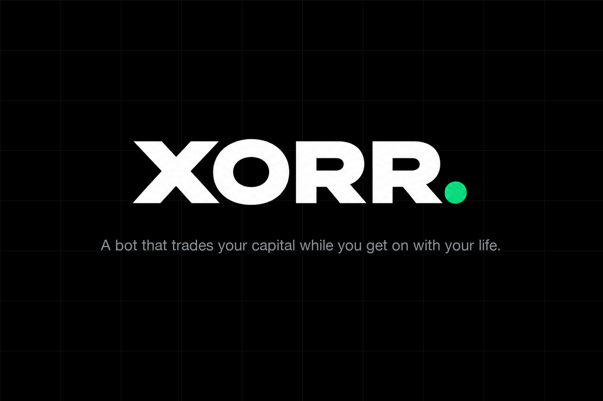

<p align="center">
  
</p>

# xorr — an AI agent that trades tokenized stocks on Solana, inside a permission you can revoke

**Built for [STOCKLANA](https://hackathons.solana.com/hackathons/stocklana).** Tokenized US stocks trade around the clock
on Solana; nobody can watch a market all night. xorr lets an agent do it for you — without ever holding your money.

- **Live app:** https://xorr-solana.vercel.app (sign in with email; it runs against a hosted mainnet fork, so the money
  is test money and every transaction is real on that fork)
- **Executor health:** https://executor-production-a672.up.railway.app/health
- **Fork RPC:** https://solana-fork-production.up.railway.app

## What it does

1. **Sign in** with email or Google. Privy creates a Solana wallet that is yours; xorr never sees its key.
2. **Fund it** with test USDC from the fork's faucet (or, on a real cluster, a Solana Pay deposit code).
3. **Grant a permission** — one transaction you sign: an SPL `ApproveChecked` on your USDC for your daily cap × the days
   it runs, plus a sell approval on each xStock, so a stop-loss can fire while you are away. xorr holds the daily cap and
   the end date and enforces them on every trade; the chain enforces the total.
4. **Hire an agent.** It watches [Backed's xStocks](https://xstocks.com) (NVDAx, TSLAx, AAPLx, MSFTx, SPYx on the fork),
   buys through **Jupiter** when a setup appears, says why in Activity, and arms a stop-loss and take-profit that sell
   unattended. It is paced: one entry per stock per day, a quarter of the grant per stock, and the risk profile's wait
   between entries (90 minutes on Balanced). **Ask it to look now** and it runs the same cycle on the spot, behind every
   gate — it either trades and shows the receipt, or says in words why it took nothing.
5. **Give each agent its own wallet, and its own rules.** An agent's wallet is a USDC token account *you* own, at an
   address derived from your key and the agent's id (`createWithSeed`). You fund it in one signature — create, transfer,
   approve the bot on it — and from then on that agent trades from it alone: the chain stops it at what the account
   holds, its sales and stop-losses pay back into it, and you can take the money back at any time. Its rules are
   yours to set and the executor enforces them on every entry: the most per trade and per day, the only stocks it may
   buy, whether it may enter while Nasdaq is shut, and the most its stop may sit under the fill.
6. **Trade yourself.** The Trade tab buys and sells any xStock with a live Jupiter quote breakdown (price impact,
   slippage, route, minimum received) and the token's backing, issuer controls and eligibility for your wallet — and
   **Tessera's pre-IPO tokens** (OpenAI, SpaceX, Kalshi), routed through Meteora, with the pool price, the issuer's mark
   and the gap between them shown before you buy.
7. **See it straight.** Holdings and P&L use each token's Token-2022 *Scaled UI* multiplier, so dividends and splits move
   the numbers the way the issuer meant. Every action, and every refusal, is on an audit trail with explorer links.
8. **Stop everything in one tap.** Safety signs an SPL `Revoke` on every account that names the bot — the agents' wallets
   included, so nothing can trade from that block on, stop-losses included — and it works with our server down. Resume
   re-signs the same grant and re-approves every agent wallet.
9. **Withdraw** to an address on your allowlist, which unlocks 24 hours after you add it.

## Why it is built this way

- **The permission is the product.** Handing a bot your money is a trust problem. Here the bot never has custody: it
  holds a delegate key that can move only what you approved, and one spend path (`server/src/executor/place.ts`) checks
  the chain, the grant record, the daily cap, the issuer's transfer gates and a live quote before anything moves — and
  refunds you if a swap does not fill.
- **Token-2022, used as intended.** Scaled UI multipliers in every balance and P&L; the issuer's pause, freeze, permanent
  delegate and transfer hook read from the chain and shown on each stock; buys refused for a wallet the issuer's gates
  would refuse.
- **Nothing is invented.** Every price is a live quote or says it has none; a fill that did not go through Jupiter is
  labelled `venue-vault`; a signature is only ever one the chain confirmed.
- **The guard is measured against someone else's number.** An xStock trades 24/7; the share behind it does not. While
  Nasdaq is shut, nothing arbitrages the pool back, so before any entry xorr compares the pool price to **Pyth's
  `Equity.US.<TICKER>/USD` feed, read straight off its Solana price account** — and holds if they have come apart by
  more than 1.2% in extended hours or 1.5% overnight. Checking a Jupiter pool price against a mark from the same
  response would be one source grading its own homework.

## How it works

| Part | What it is |
|---|---|
| App | Expo (web + iOS/Android), Privy Solana embedded wallet — signs grant, revoke, sells and withdrawals |
| Executor | Hono + Postgres (`server/`): the grant record, `guardAndSpend`, the scheduler (agents, exits, recurring buys), Jupiter |
| Chain | `solana-test-validator --clone` of mainnet: real USDC, xStocks (Token-2022), Jupiter v6 and today's routes |
| Oracle | **Pyth** `Equity.US.*` price accounts on Solana mainnet (`server/src/market/pyth.ts`) — the independent Nasdaq print the off-hours guard measures against |
| Hosting | Railway (fork + executor + Postgres), Vercel (web) |

### The off-hours guard, and why Pyth

The hard part of trading a tokenized equity is the fourteen hours a day the equity is not trading. The token keeps
moving; the thing it represents does not. To know whether a pool price is still the share's price you need a second
opinion from somebody who is not the pool.

Pyth is that, and it is already on chain — so the reference for a trade that settles on Solana is itself a Solana
account, one `getMultipleAccounts` away, with no key and no vendor relationship. Three details worth reading the code
for:

- **Both shards, freshest wins.** The push oracle writes each feed to sharded accounts maintained by whoever pays for
  the updates. Shard 0's equity feeds are abandoned — NVDA there was last written 2026-08-26. Shard 1 is live. Hardcoding
  a shard number would be betting on one afternoon's evidence.
- **Staleness is keyed to the session, not to a clock.** A feed silent for sixteen hours is not broken, it is Tuesday
  night — and that is exactly when the guard matters. Off-hours the last close stands (up to four days, past which it is
  an abandoned shard rather than a weekend); during a regular session the print must be minutes old or the publishers
  are down.
- **The confidence interval is load-bearing.** A feed reporting "around $220, give or take 3%" cannot measure a 1.2%
  decoupling, so anything wider than 100 bps is refused outright rather than rounded into a verdict.

When Pyth has no usable mark — COIN, today — xorr falls back to the issuer's own mark and **says so in the verdict**,
because "drifted 1.4% from Pyth's NVDA feed" and "drifted 1.4% from the issuer's own mark" are different claims.

## Verify it yourself, on your own machine

The Stocklana claim is that an agent buys an xStock (a Token-2022 tokenized equity) **through a
real Jupiter route, on-chain**, inside a capped permission the owner can revoke. This section lets
you check that on your own machine in about ten minutes. You need no accounts and no API keys.
Each command below was run from a fresh `git clone` into an empty directory before it was written
here.

### 1. Prerequisites

| | version verified | why |
|---|---|---|
| Node.js | 26.5 (needs ≥ 20.11 for `import.meta.dirname`) | runs the tools through `tsx` |
| Solana CLI with `solana-test-validator` | 3.1.11 (Agave) | the fork, and `solana confirm` |
| PostgreSQL | 16 | only for step 4 (the executor's database) |
| Internet access | — | the fork clones accounts from mainnet, and prices come from Jupiter's live quote API |

Install the Solana CLI with `sh -c "$(curl -sSfL https://release.anza.xyz/stable/install)"`, then put
its `bin` directory on your `PATH`.

**Env var names.** The proofs below need **none** of these set; the defaults are shown in brackets.
You never have to paste in a secret.

- `FORK_RPC`: where the fork listens [`http://127.0.0.1:8899`]. Set it if 8899 is already taken; everything below follows it.
- `MAINNET_RPC`: upstream the fork clones from [`https://api.mainnet-beta.solana.com`]. Set it to your own RPC if the public one rate-limits you.
- `DATABASE_URL`: Postgres for step 4 [`postgres://$USER@localhost:5432/xorr`].
- `PROVE_USD`: dollar size of the proof buy [`100`].
- `XORR_KEY_DIR`, `XORR_KEY_PAYER`, `XORR_KEY_DELEGATE`, `XORR_KEY_DEV_OWNER`, `XORR_KEY_VENUE_VAULT`: optional. If none is set, the fork uses deterministic development keypairs, so your addresses will match the ones below.

### 2. Clone and install

```bash
git clone https://github.com/nickthelegend/xorr-solana.git && cd xorr-solana
npm install && (cd server && npm install)
export FORK_RPC=http://127.0.0.1:8899   # or any free port, e.g. :18899
```

### 3. Start the mainnet fork

```bash
npx tsx infra/solana-fork/fork-bootstrap.ts
```

This starts `solana-test-validator` on the port in `FORK_RPC`. The faucet and gossip ports shift
with it, so a second fork on the same machine does not collide. The validator clones these from
mainnet:

- the real **USDC** mint (`EPjFWdd…`) and **NVDAx** mint (`Xsc9qvG…`, Token-2022)
- the **Jupiter v6** program (`JUP6Lkb…`) and **Orca Whirlpool** program (`whirLb…`)
- today's Jupiter routes, both directions, for NVDAx, TSLAx, AAPLx, MSFTx and SPYx — resolved live from Jupiter's
  `swap-instructions` at boot (`server/src/solana/routeAccounts.ts`): every pool, vault, tick array, oracle, lookup
  table and AMM program the routes touch

The bootstrap then airdrops SOL and funds the dev owner with 25,000 USDC and 10 NVDAx. It writes
`.env.fork` and exits, and the validator keeps running in the background. A passing run ends with:

```
Wrote <repo>/.env.fork successfully.
Fork bootstrap complete! Run tests with:
  FORK_RPC=http://127.0.0.1:8899 CHAIN=1 npx vitest run src/solana/fork.chain.test.ts
```

To stop the fork later, run `pkill -f "solana-test-validator.*--rpc-port ${FORK_RPC##*:}"`.

### 4. The database (optional for the proofs)

The two proof tools do not touch Postgres. The executor and the agent do, so you can bring the real
schema up with:

```bash
createdb xorr
(cd server && DATABASE_URL=postgres://$USER@localhost:5432/xorr npm run migrate)
```

On a fresh database it prints `applied <file>` for each migration in `server/src/db/migrations/`.
We got 35 rows in `schema_migrations` and 30 tables. It records what it applied, so running it again
is free.

### 5. Proof: a Jupiter-routed xStock buy

```bash
npx tsx tools/prove-solana-xstock-buy.ts
```

The tool makes a capped SPL approval, with the owner signing. It then sends a $100 USDC → NVDAx buy
through the executor's single spend path, `guardAndSpend`, with the delegate signing. Finally it
reads the transaction's own logs back from the ledger. A passing run prints the following. The
signatures, slots and prices are from our run and will differ in yours.

```
=== 1. Real mainnet state cloned onto the fork ===
  NVDAx mint                 Xsc9qvGR1efVDFGLrVsmkzv3qi45LTBjeUKSPmx9qEh owner=TokenzQdBNbLqP5VEhdkAS6EPFLC1PHnBqCXEpPxuEb
  Jupiter v6 (cloned)        JUP6LkbZbjS1jKKwapdHNy74zcZ3tLUZoi5QNyVTaV4 owner=BPFLoaderUpgradeab1e11111111111111111111111 (executable)
  NVDAx multiplier           1.001701196801074
=== 2. Capped SPL approval (owner signs) ===
  delegated cap              500 USDC
=== 4. guardAndSpend: BUY $100 NVDAx (delegate signs) ===
  BUY SIGNATURE              3aheLFM37WDnqkFtJo1HCvBuGmEN21PBGEXV2QgQdWbywb8B6nmpxwCwgs82gRczXKStF8XoGdtUW1fxvS3q64Se
  BUY SLOT                   34
  PRICE SOURCE               live Jupiter v6 quote API (off-chain HTTP; no program invoked)
  FILL PATH                  jupiter-route — Jupiter v6 invoked on-chain, CPI into the AMM
  jupiter invoked            true
  route + AMM swap           true / true
=== 6. After ===
  USDC                       24900 (-100.000000)
  delegated cap left         400 USDC
=== 7. Reported fill vs on-chain delta ===
  drift                      1.6653345369377348e-16

All proofs held. Verify independently with:
  solana confirm -v <signature> --url http://127.0.0.1:8899
```

Check two things. **`PRICE SOURCE`** is only ever a number fetched over HTTP. **`FILL PATH`** is
what happened on-chain, and it has two possible values:

- `jupiter-route`: the Jupiter program ran and swapped against the pool's reserves.
- `venue-vault`: a capped delegate transfer at the quoted price, filled from a maker account. It is legitimate, but it is **not** a Jupiter swap.

The tool **exits non-zero** on anything other than `jupiter-route`, and it prints
`PROOF FAILED: Filled through 'venue-vault'`. It also fails if the reported fill and the on-chain
balance change disagree after applying the Token-2022 Scaled-UI multiplier (step 7).

### 6. Check the signature yourself, without our code

```bash
solana confirm -v <BUY SIGNATURE> --url $FORK_RPC
```

```
  Status: Ok
  Log Messages:
    Program JUP6LkbZbjS1jKKwapdHNy74zcZ3tLUZoi5QNyVTaV4 invoke [1]
    Program log: Instruction: Route
    Program whirLbMiicVdio4qvUfM5KAg6Ct8VwpYzGff3uctyCc invoke [2]
    Program log: Instruction: SwapV2
    Program TokenkegQfeZyiNwAJbNbGKPFXCWuBvf9Ss623VQ5DA invoke [3]     ← USDC in  (SPL Token)
    Program log: Instruction: TransferChecked
    Program TokenzQdBNbLqP5VEhdkAS6EPFLC1PHnBqCXEpPxuEb invoke [3]     ← NVDAx out (Token-2022)
    Program log: Instruction: TransferChecked
    Program whirLbMiicVdio4qvUfM5KAg6Ct8VwpYzGff3uctyCc success
    ...
    Program JUP6LkbZbjS1jKKwapdHNy74zcZ3tLUZoi5QNyVTaV4 success
```

**`JUP6Lkb… invoke [1]` followed by `Instruction: Route`** means the transaction's top-level
instruction is Jupiter v6's `Route`. It is the real mainnet program bytecode, cloned onto the fork.
**`whirLb… invoke [2]` followed by `Instruction: SwapV2`** means Jupiter then made a cross-program
call into Orca Whirlpool, and Whirlpool swapped against the cloned USDC/NVDAx pool. The `[3]` lines
are the pool moving USDC in and NVDAx out. If a fill had gone through the venue vault instead, you
would see no `JUP6Lkb…` line at all, only a token `TransferChecked`.

### 7. More on-chain proofs: the cap, the kill switch, and a sell

```bash
(cd server && CHAIN=1 npx vitest run src/solana/fork.chain.test.ts)   # 4 passed
```

- Proof 2: the SPL cap rejects an over-cap transfer **on chain**.
- Proof 3: revoking the permission (the kill switch) stops new orders while resting exits stay live.
- Proof 4: a buy, then a sell back.

### 8. Proof: deposit handoff, and a withdrawal that settles

```bash
npx tsx tools/prove-solana-deposit-withdraw.ts
```

The tool runs four parts:

- **Part 1: the MoonPay sandbox handoff.** This is a signed checkout URL, not arrival of funds; see the limitations.
- **Part 2: the ATA addresses.** It derives the associated token accounts for the user and the destination.
- **Part 3: the address rules.** It applies the withdrawal allowlist's address rules.
- **Part 4: a real withdrawal on the fork.** A fresh user wallet is funded with SOL for its own fee
  and with 200 USDC. The destination's token account is created. Then the **user** signs a 50 USDC
  SPL transfer against a real blockhash, and the tool broadcasts and confirms it. It reads both
  balances back from the chain. Your addresses and signature will differ from these, which are from
  our run; the balances will match:

```
--- 4. USER-SIGNED SPL TOKEN TRANSFER & AUDIT RECORDING ---
  ✔ User funded with SOL on the fork to pay its own fee
  ✔ Funded account is the ATA the app derives, not a second account
  ✔ Destination ATA exists and matches the derived address
  Before — user: 200 USDC, dest: 0 USDC
  ✔ Created SPL Token transfer instruction
  ✔ Signer matches user wallet (non-custodial: user signs, not executor)
  ✔ Transaction is in the ledger, read back by signature
  ✔ Ledger records no error for the withdrawal
  ✔ Destination balance rose by exactly 50 USDC
  ✔ Source balance fell by exactly 50 USDC
  ✔ What left the source is what arrived at the destination
  WITHDRAW SIGNATURE: 5zTaos5EAAkQPfzbvzZ3uAHL4c8AmcDfofzRSoD7nhPbj1qC5cvaR2YL14469GcTWRGNbifVFAtiLvUziPM6Ce2N
  SLOT:               31
  Amount:             50 USDC (50000000 raw units)
  From:               CvQHdBAL4rb7xXA8PE4K7xhk4bzbAydGsF7TF7FhNGZT
  To:                 FF9XTb4fRDzWqL8aUL1KdSA4FLPTVo5oHd63Qsfdty35
  After — user: 150 USDC, dest: 50 USDC
  Verify:             solana confirm -v <signature> --url http://127.0.0.1:8899

================================================================
  ALL DEMO PROOFS PASSED (MoonPay Dev Sandbox + Solana Fork)
================================================================
```

Any failed check prints `✖ FAIL` and the tool exits 1. Confirm the withdrawal the same way as in
step 6:

```
$ solana confirm -v <WITHDRAW SIGNATURE> --url $FORK_RPC
  Account 0: srw- CvQHdBAL4rb7xXA8PE4K7xhk4bzbAydGsF7TF7FhNGZT (fee payer)
  Status: Ok
    Program TokenkegQfeZyiNwAJbNbGKPFXCWuBvf9Ss623VQ5DA invoke [1]
    Program log: Instruction: Transfer
```

Account 0 is both the fee payer and the only signer, and it is the **user's** address from `From:`
above, not the executor's. That is the non-custodial property, read straight off the transaction.


### Known limitations — read these before you believe us

- **It is a fork, not mainnet.** The money is test money on a `solana-test-validator --clone` of mainnet. The programs,
  mints and pools are mainnet's own, cloned at boot; nothing here moves real funds.
- **A fork's pools stop at boot.** A running validator cannot re-clone accounts, so over hours the pools drift from the
  live price and a route can fail simulation. The fill then settles against the venue vault at the live quote and is
  labelled `venue-vault` — never called a Jupiter swap. Re-run the bootstrap for fresh routes.
- **A sale you sign in the app settles against the venue vault** at Jupiter's live quote, in one transaction you and
  the vault both sign. A sale the agent makes (an exit) is routed through Jupiter.
- **Card deposits need MoonPay keys**, which this repository does not have. Without them the Deposit screen says so;
  the fork faucet works.
- **Agent reasoning is deterministic without an `OPENROUTER_API_KEY`.** Each trade still names the setup and the
  numbers behind it; with a key the sentence is written by a model.
- **An agent's rules are enforced by the executor**, like the daily cap; what an agent can spend at all is enforced by
  the chain, because it is what its own wallet holds.
- **Agents trade xStocks, not pre-IPO tokens.** A private company has no share price to check the pool against, and the
  agent does not enter what it cannot check. Pre-IPO tokens are bought and sold by the owner.
- **The daily cap is enforced by the executor**, as SPL has no notion of a day; the chain enforces the total you
  approved. Stopping is always the chain's own `Revoke`.

## Tests

- App: `npm test` (2,600+ tests), `npm run typecheck`, `npm run lint`.
- Server: `cd server && npm test` (1,350+ tests), `npm run typecheck`.
- On-chain proofs against a fresh fork: `npx vitest run server/src/solana/fork.chain.test.ts` — capped delegation,
  over-cap refusal, kill switch, and a Jupiter-routed buy and a sell of the owner's own shares.
- End-to-end run of every flow in the app, with signatures: [`docs/TESTPLAN-SOLANA.md`](docs/TESTPLAN-SOLANA.md).
- What is left and why: [`PLAN.md`](PLAN.md).

## History

xorr started on Base (ETHOnline 2026, Base Build Camp). That build's README — its contracts, sponsors and screens — is
in [`docs/base/README-base.md`](docs/base/README-base.md). The Solana build hides every Base-only screen.
